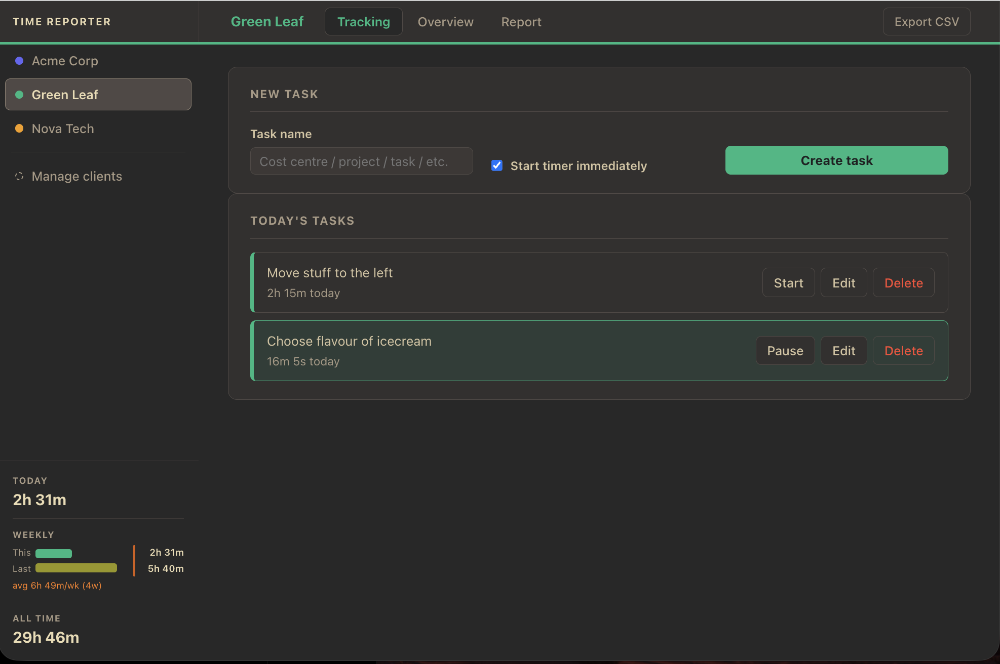
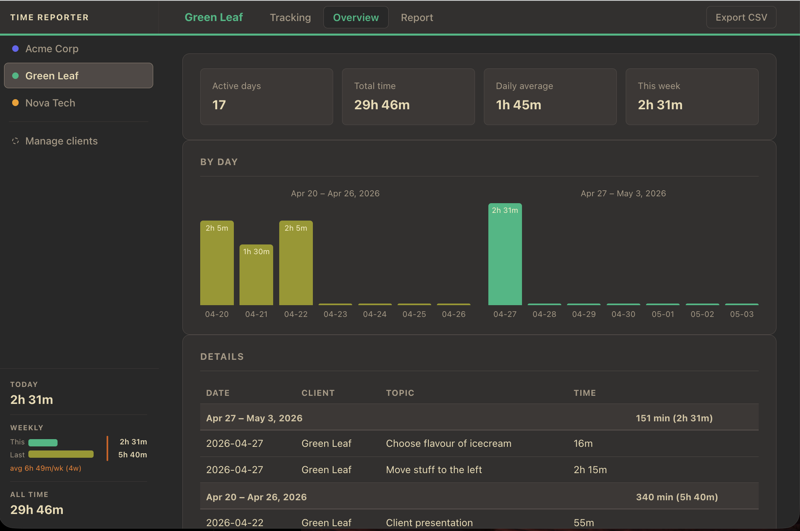
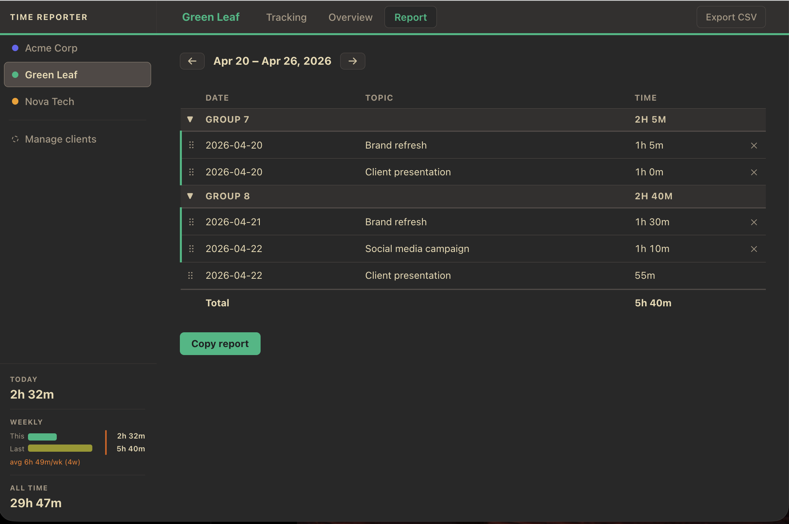
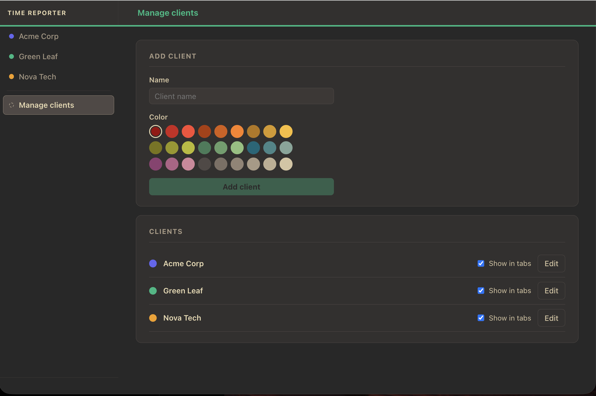

# time-reporter

A lightweight time tracking app for freelancers and consultants who bill multiple clients.

Track work by client and topic throughout the day, review daily and weekly summaries, and export to CSV for invoicing. Time is stored locally in SQLite — no cloud account required.

## Screenshots

| | |
|---|---|
|  |  |
|  |  |

## Features

- **Client-focused** — switch between clients in the sidebar; each client has its own colour and history
- **Interval tracking** — start and stop a timer; intervals are stored and aggregated by day
- **Manual overrides** — adjust reported time for any day directly in the edit dialog; subsequent timer use adds on top
- **History** — weekly bar chart and a full history table grouped by week, with edit, delete, and CSV export per client
- **Reflect** — weekly view for reviewing work; drag entries onto each other to form named groups, collapsible and persisted per week
- **Invoice tracking** — mark a date as invoiced; entries at or before that date are dimmed
- **macOS menu bar** — an [xbar](https://xbarapp.com) plugin (`scripts/time-reporter.5s.sh`) shows the active task and elapsed time; click to pause or start a recent task

## Requirements

- **Node 22 or later** (needed for `--experimental-strip-types`)
- npm (comes with Node)

## Getting started

```bash
npm install
npm start        # starts backend + frontend together
```

Then open [http://localhost:5173](http://localhost:5173).

The SQLite database is created automatically on first run at `data/time-reporter.sqlite`.
No `.env.local` is needed — the Vite dev server proxies API requests to the backend automatically.

## Demo mode

To explore the app with pre-seeded fictional data:

```bash
npm run seed:demo    # create data/demo.sqlite with 3 clients (~4 weeks of data)
npm run stop         # stop any running backend first
npm run start:demo   # start against the demo database
```

`start:demo` will refuse to start if port 3001 is already occupied, so production
and demo data can never be served at the same time.

## macOS menu bar (xbar)

Install [xbar](https://xbarapp.com) (`brew install --cask xbar`), then symlink the plugin:

```bash
brew install jq   # required by the plugin
ln -s "$PWD/scripts/time-reporter.5s.sh" \
      ~/Library/Application\ Support/xbar/plugins/time-reporter.5s.sh
```

The plugin refreshes every 5 seconds. It shows the active task and today's accumulated time. Clicking opens a dropdown to pause or start a recent task. Requires the backend to be running (`npm start`).

---

[CLAUDE.md](CLAUDE.md) — architecture and development notes.
[LICENSE](LICENSE)
